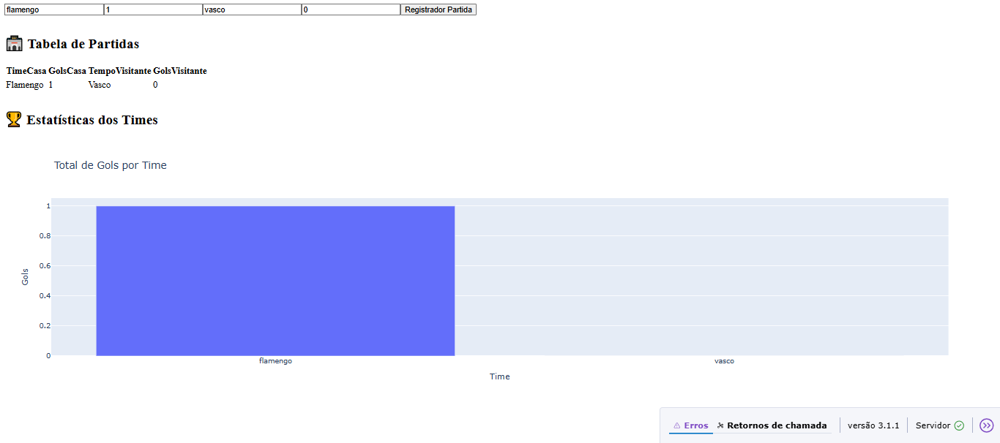

# ⚽ Sistema de Pontuação e Estatísticas de Partidas de Futebol

Este projeto é um **dashboard interativo** para registro e análise de partidas de futebol, perfeito para ligas amadoras, campeonatos entre amigos ou uso acadêmico, com foco em visualização e estatísticas dinâmicas.

---

## 📸 Demonstração



---

## 🚀 Funcionalidades

- Registro detalhado das partidas com informações dos times e placares.
- Visualização dinâmica e tabela histórica das partidas registradas.
- Gráficos interativos de desempenho e estatísticas dos times.
- Atualização automática e responsiva por meio de callbacks.

---

## 🛠️ Tecnologias Utilizadas

- **Python** – Backend robusto e manipulação de dados
- **Dash (Plotly Dash)** – Framework para dashboard web interativo
- **Pandas** – Processamento eficiente e análise dos dados
- **Plotly Express** – Visualização gráfica moderna e interativa
- **CSV** – Armazenamento persistente dos dados

---

## 🌐 Link do projeto no GitHub

[https://github.com/Eduuh007/sistema-futebol]

---

## 📂 Como executar localmente

1. Clone o repositório:

   ```bash
   git clone https://github.com/Eduuh007/sistema-estatisticas-futebol.git
   cd sistema-estatisticas-futebol

Instale as dependências (recomenda-se usar um ambiente virtual):

pip install -r requirements.txt

Execute o dashboard:

python app.py

Acesse no navegador o endereço:

http://127.0.0.1:8050/

Desenvolvido por Eduardo Martins

GitHub: https://github.com/Eduuh007

LinkedIn: https://www.linkedin.com/in/eduardo-martins-575521245

Palavras-chave e Hashtags
#Dash #Python #Plotly #Pandas #Dashboard #EstatísticasFutebol #AnáliseDeDados #CSV #VisualizaçãoDeDados #GráficosInterativos #DataVisualization